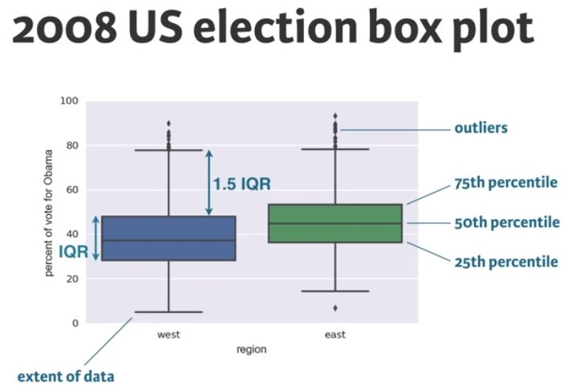
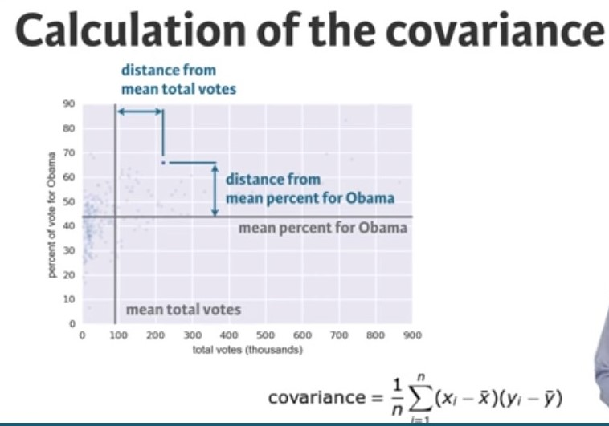
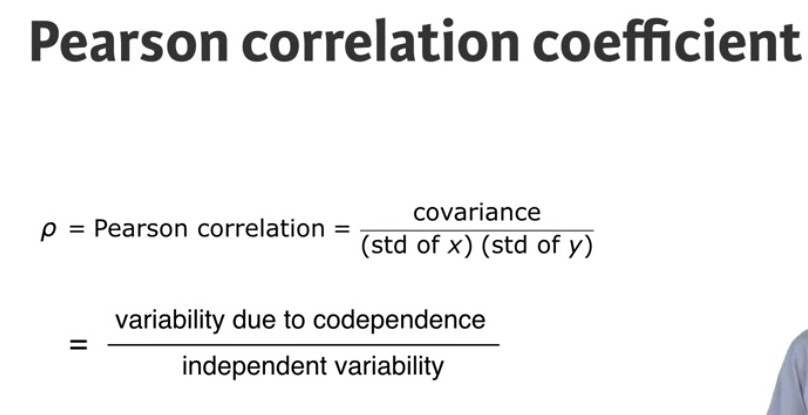
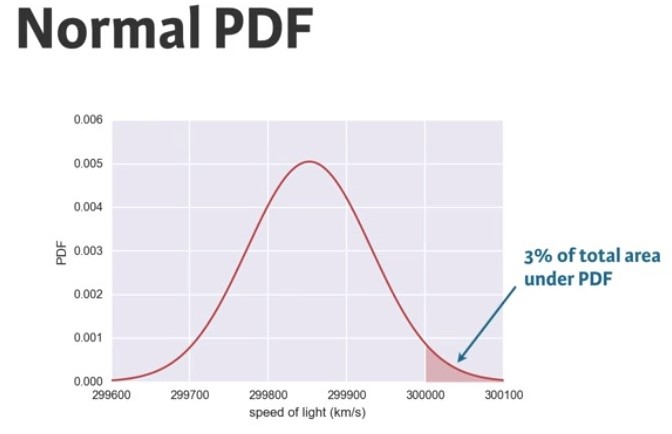
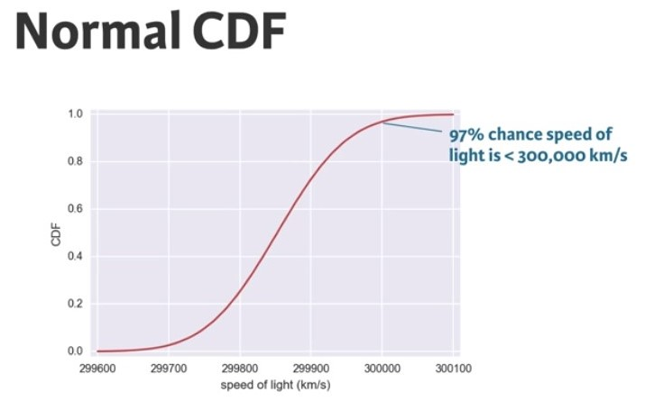
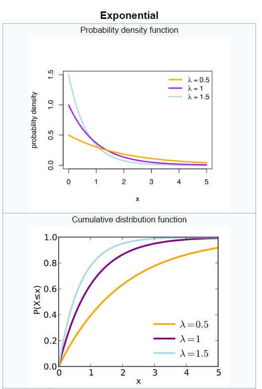
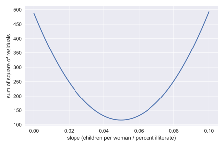
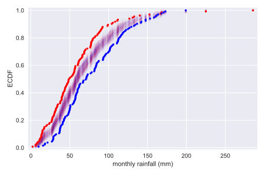

# Pratical Statistics
---

>*Study notes from Statistics Fundamentals with Python DataCamp course*

# Table of Content

## EDA  

- __ECDF__

The ECDF essentially allows you to plot a feature of your data in order from least to greatest and see the whole feature as if is distributed across the data set.

*For example: what percentage of __[count of something]__ have a __[name of feature]__ less than __[a number]__*

- __Percentile__

>*What does it mean to be in the 99th percentile?*

For example: to score 99 percentile means that there are about 99 percent of people( who appeared for the test )who have scored less than you,that means you are in the top one percent of students who have scored great. [^1]

- __Box Plot__



- __Covariance__

Covariance measure how two variables varies together.



- __Pearson Correlation Coefficient__

It is a comparison of the variability in the data due to codependence (covariance) to the variability inherent to each variable independently (standard deviation)



## Probabilities (Discrete variables)

- __Bernoulli Trials__

```python
np.random.binomial(n, p, size)
```

where
_n_ -> sample size
_p_ -> probability
_size_ -> number of trials

Bernoulli trial (or binomial trial) is a random experiment with exactly two possible outcomes, "success" and "failure", in which the probability of success is the same every time the experiment is conducted. foot [^2]

- __Probability Mass Function (PMF)__

PMF is the set of probability for each possible discrete outcome of a situation, simulation or problem. PMF often seen as a property of discrete probability distribution. When the probability is a Bernoulli distribution, the PMF becomes a Binomial distribution. i.e. the number _r_ of successes _n_ Bernoulli trials with probability _p_ of success, is __Binomially__ distributed.[^3]

Another way to represent a distribution is a probability mass function (PMF), which maps from each value to its probability. [^4]

- __Poisson Process__

```python
np.random.poisson(lam, size)
```

where
_lam_ -> average poisson events per interval
_size_ -> number of trials

The timing of the next event is completely independent of when the previous event happened.[^3]

Examples of Poisson Process: Hit on a website during a given hour and Natural birth in a given hospital.

The Poisson distribution takes one parameter which is the average observation or arrival per time interval. i.e. the number _r_ of arrival on a Poisson Process in a given time interval with average rate of _$\lambda$_ arrival per interval is Poisson distributed.

Poisson distribution is the limit of Binomial distribution for low probability of success and large number of Bernoulli trials. i.e. for rare events! (The lower the probability and the higher the sample size, the closer Binomial distribution approximate to Poisson distribution)

Importantly, the Poisson distribution is often simpler to work with, comparing to Binomial distribution which takes _n_ events and _p_ probability, because it has only one parameter instead of two for the Binomial distribution.

## Probabilities (Continuous variables)

- __Probability Density Function (PDF)__

PDF describes the chances (relative likelihood) of observing a value of continuous variable. The probability is measure by area under the PDF as shown below.



CDF can also be used to measure probability. For example, the probability that the speed of light is greater than 300k km/s is 3%



- __Normal Distribution__

Normal distribution is a famous distribution with symmetrical shape and has one peak. Normal distribution is described by _mean_, which determines the center of the peak, and _standard deviation_, which measures how wide the peak is or how spread out the data are.

~~~python
np.random.normal(mean, sd, size)
~~~

where _mean_ and _sd_ can be computed from the accual data and pass it to the `np.random.normal`

> Note: do not confuse between Normal distribution parameters (mean and SD) with calculated mean and SD from data.

*__Some caveats of Normal Distributions__*

1. Some real world data sets might not be normally distributed. One should lay out ECDF of the data with theoritical Normal CDF, deviation from Normal Distribution might be observed. Another way to uncover this anomaly is by checking the distribution of another property of the data or feature.
2. Normal distribution has light tails, which means outliers are rare. However, that not necessary the case on on real world data sets.

- __Exponential Distribution__

Another type of continuous distribution is Exponential distributions. It is related to Poisson processes where it model the waiting time, for example, for an event in Poisson distribution to happen.

> the exponential distribution (known as the negative exponential distribution) is the probability distribution of the time between events in a Poisson point process, i.e., a process in which events occur continuously and independently at a constant average rate. [^5]



## Practical Application of Statistical Techniques

The way we estimate probability distibution of a given data set is by generate a random sample of a given distribution, say Normal or Exponential distributions, then plot the real and thoeretical CDFs to confirm if the real dataset ollow a particular distribution or not.

But how would we know if the estimated parameter is the optimal value or not? A simple expirement can reveal if the estimated parameter is optimal or not. We can run the same expirements number of times with different values of the parameter and observe if the new theoretical CDF is a better match to ECDF of real dataset or not. If the previous estimated value is better fit, then we conclude that the previously estimated parameter is the optimal value.

- __Finding Optimal Parameters__

There are alot of algorithms that generates optimal parameters for a given model. For example, `np.polyfit()` function will try to find the best fit for the parameter by optimizing the sum of the squares of the residuals, also known as RSS (for residual sum of squares).

There is a number of ways to visualize if the model chose the optimal parameter or not.

One, by trying to sample different underlying values from a given distribution and overlap its ECDF with the ECDF of the original data. This works for a single variable.

Often times we need to model the data against a model that takes more than one variable, for example linear regression. In this case, we can compare the RSS against number of value of the slope (fix the intercept to be the value generated by `np.polyfit()`) as shown in the chart below.



- __Bootstrap and its confidence intervals__

_Bootstrap_ is a method to recompute summary statistics from a dataset without the need to run the experiment over and over again. Basically, you resample from the existing dataset to generate hypothesized (or probabilistically estimated) experiments.

_Confidence intervals_ are intervals that tells you how accurate, or confident you are in, the drawn sample. in other words, If we repeated measurements over and over again, p% of the observed values would lie within the p% confidence interval.

- __Pairs Bootstraps__

The above bootstarp method works for nonparametric inference, which makes no assumptions about the model or underlying probability distribution. The generated replicates are solely derived from the data itself.

What if you want to understand the confidence of generated optimal pararmeters found in a parametric model like linear regression. In this case we need to re-sample the data on two or more variables, i.e. re-sample the data in pairs.

- __Hypothesis Testing__
Hypothsis testing is a technique to measure accuracy of the assumption about a particular model's parameter. By randomly sampling the observed data, one can tell if the estimated model is reasonably descripting the observed data or not. In other words if the hypothesis was true or not.

Exampling of hypothesis testing is permutation sampling, which is used to test if two variables has the same probability distribution.

Let take an example of Sheffield Weather Station data. We are going to test if the distribution of monthly rainfalls in June is identical to Nov rainfalls.



Notice that the permutation samples ECDFs overlap and give a purple haze. None of the ECDFs from the permutation samples overlap with the observed data, suggesting that the hypothesis is not commensurate with the data. June and November rainfall are not identically distributed.


[^1]: https://www.quora.com/What-does-it-mean-to-be-in-the-99th-percentile
[^2]: https://en.wikipedia.org/wiki/Bernoulli_trial
[^3]: DataCamp video from "Statistical Thinking in Python 1"
[^4]: Think Stats 2e by Allen B. Downey.
[^5]: <https://en.wikipedia.org/wiki/Exponential_distribution>
